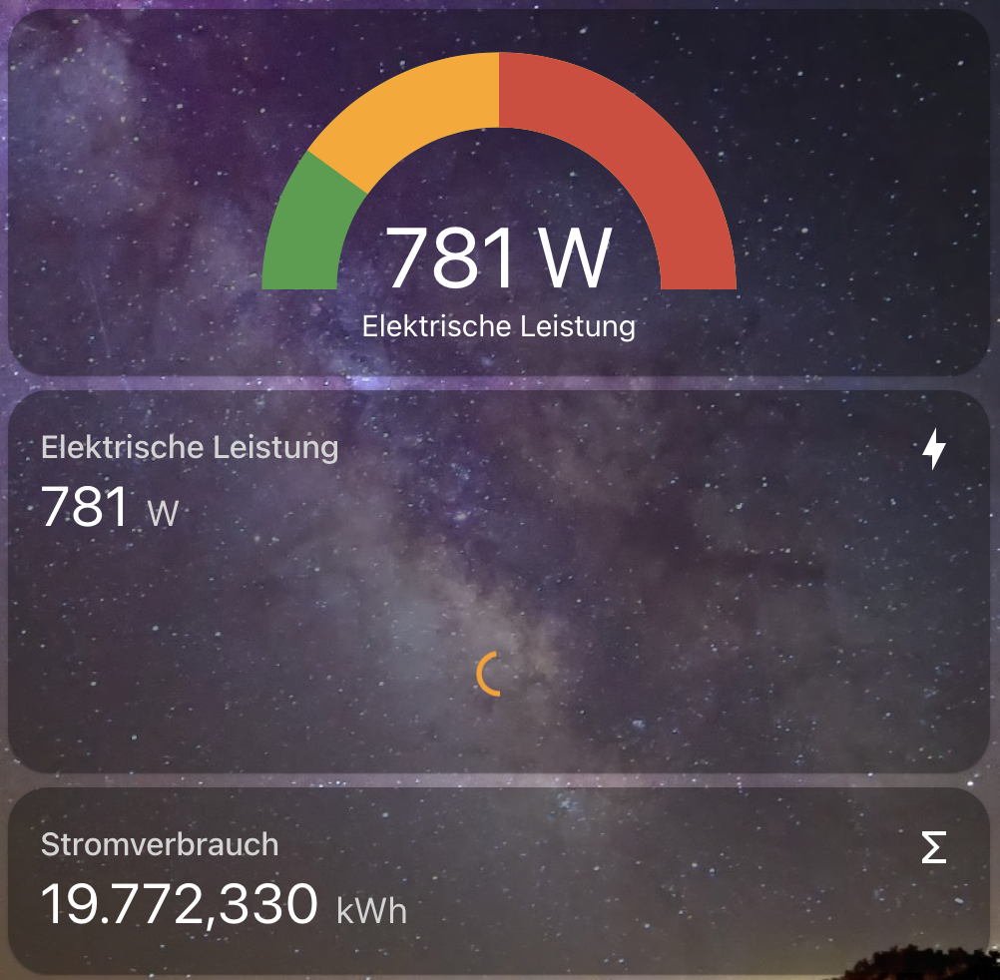

# Power Meter
This device is used to read electric power usage from digital power meter with an blinking LED using an ESP8266 chip. ESPHome enables the values to be used in Home-Assistant.

A Fototransistor connected to Pin D1 captures the pulses of the power meter LED.

The wiring schema is as follows:
- Fototransistor Collector to 3.3V
- Fototransistor Emitter to D1
- 10 kOhm Resisitor from Fototransistor Emitter to GND
